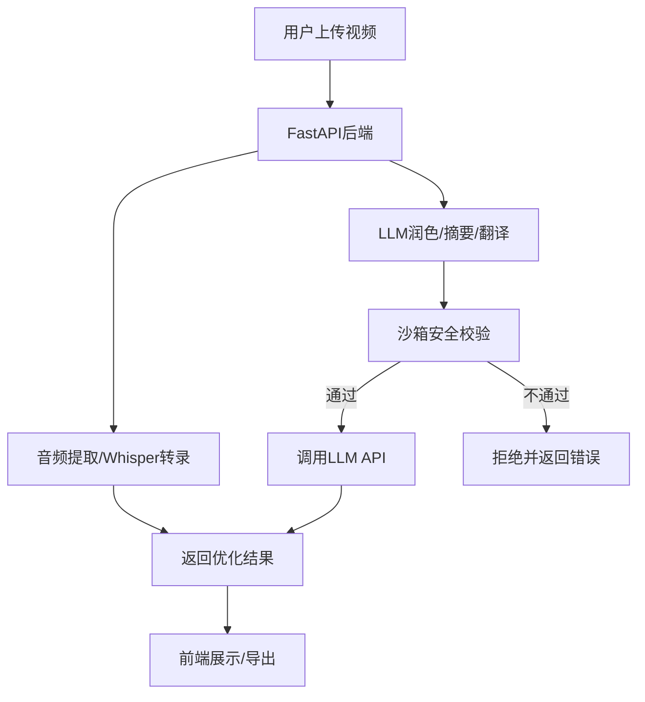

# 🎬 视频转录生成器

一个基于Whisper AI的智能视频转录工具，支持多语言界面和LLM文本优化功能。

## 📊 项目进度（2024年12月）

### ✅ 已完成功能

#### 🎯 核心转录功能
- ✅ 视频文件上传和音频提取（支持拖拽上传）
- ✅ Whisper AI语音识别（支持多种模型：tiny/base/small/medium/large）
- ✅ 多语言界面支持（中文、英语、俄语、德语、法语、日语）
- ✅ 实时处理日志显示
- ✅ 自动语言检测和手动语言选择

#### 🔒 安全沙箱机制
- ✅ API密钥格式验证和安全校验
- ✅ 敏感信息检测（支持中英文、数字混合模式）
- ✅ 资源限制和并发控制
- ✅ 审计日志系统
- ✅ 完整的自动化测试覆盖

#### 🤖 LLM集成功能
- ✅ 多LLM提供商支持（OpenAI、Anthropic、Google Gemini）
- ✅ 文本润色、摘要、翻译功能
- ✅ 安全沙箱验证机制
- ✅ API密钥安全代理

#### 🐳 容器化部署
- ✅ Docker容器化配置
- ✅ Kubernetes部署配置
- ✅ 安全上下文和资源限制
- ✅ 健康检查和监控

### 🔮 开发中功能

#### 🎨 前端优化
- [ ] LLM功能用户界面集成
- [ ] 实时进度条和状态显示
- [ ] 响应式设计优化

#### 📹 视频处理增强
- [ ] 视频链接直传功能
- [ ] 批量文件处理
- [ ] 更多视频格式支持

#### 💾 数据管理
- [ ] 转录历史记录
- [ ] 多格式导出（TXT/SRT/VTT）
- [ ] 用户会话管理

### 📋 待开发功能

#### 🔧 系统优化
- [ ] API限流和防刷机制
- [ ] OAuth/SSO用户认证
- [ ] 任务队列和异步处理
- [ ] 缓存机制优化

#### 🌐 部署扩展
- [ ] Streamlit平台迁移
- [ ] Hugging Face Spaces部署
- [ ] Google Colab集成
- [ ] 生产环境部署文档

---

## 🏗️ 项目架构



## 🚀 快速开始

### 环境要求
- Python 3.8+
- FFmpeg
- 至少2GB可用内存

### 1. 安装FFmpeg
```bash
# macOS
brew install ffmpeg

# Ubuntu
sudo apt install ffmpeg

# Windows
# 下载 https://ffmpeg.org/download.html
```

### 2. 安装项目依赖
```bash
# 克隆项目
git clone <repository-url>
cd video-transcript-generation

# 安装Python依赖
pip install -r requirements.txt
```

### 3. 运行应用
```bash
# 方法1: 使用启动脚本
python run.py

# 方法2: 直接启动
python app.py
```

### 4. 访问应用
打开浏览器访问: http://localhost:8080

## 📁 项目结构

```
project-root/
├── app.py               # FastAPI主应用
├── languages.py         # 多语言界面配置
├── sandbox_config.py    # 沙箱安全逻辑
├── test_sandbox.py      # 沙箱测试脚本
├── video_downloader.py  # 视频下载模块
├── run.py               # 启动脚本
├── setup.py             # 安装配置
├── requirements.txt     # Python依赖
├── Dockerfile           # Docker构建配置
├── k8s-deployment.yaml  # Kubernetes部署配置
├── SANDBOX_GUIDE.md     # 沙箱技术说明
├── README.md            # 项目文档
└── venv/                # 虚拟环境
```

## 🛠️ 技术栈

### 后端技术
- **FastAPI** - 现代Python Web框架
- **Faster-Whisper** - 高性能语音识别
- **FFmpeg** - 音视频处理
- **Pydantic** - 数据验证

### 前端技术
- **HTML5/CSS3** - 用户界面
- **JavaScript** - 交互逻辑
- **拖拽上传** - 文件处理

### 安全机制
- **沙箱验证** - API调用安全
- **敏感信息过滤** - 内容安全检查
- **资源限制** - 系统资源保护
- **审计日志** - 操作记录追踪

### 部署技术
- **Docker** - 容器化部署
- **Kubernetes** - 容器编排
- **健康检查** - 服务监控

## 🎯 使用说明

### 基本转录流程
1. 打开应用首页
2. 选择界面语言
3. 选择视频语言（或自动检测）
4. 拖拽或选择视频文件
5. 等待处理完成
6. 查看转录结果和详细日志

### LLM功能使用
1. 在转录结果页面选择"文本优化"
2. 选择LLM提供商（需要API密钥）
3. 选择优化类型（润色/摘要/翻译）
4. 输入API密钥（经过安全验证）
5. 获取优化后的文本

### 配置选项
在 `app.py` 中可以调整：
- Whisper模型大小 (tiny/base/small/medium/large)
- 文件大小限制
- 音频质量设置
- 沙箱安全参数

## 🧪 测试

### 运行沙箱测试
```bash
python test_sandbox.py
```

### 测试覆盖
- ✅ API密钥验证
- ✅ 敏感信息检测
- ✅ 资源限制检查
- ✅ 审计日志功能
- ✅ LLM集成验证

## 🐳 容器化部署

### Docker部署
```bash
# 构建镜像
docker build -t video-transcript .

# 运行容器
docker run -p 8080:8080 video-transcript
```

### Kubernetes部署
```bash
# 应用配置
kubectl apply -f k8s-deployment.yaml
```

## 🔧 开发指南

### 添加新语言支持
1. 在 `languages.py` 中添加语言配置
2. 更新前端语言选择器
3. 测试界面显示

### 扩展LLM提供商
1. 在 `app.py` 中添加新的API调用函数
2. 更新沙箱配置中的允许域名
3. 添加相应的测试用例

### 安全配置
- 修改 `sandbox_config.py` 中的安全参数
- 更新敏感词列表
- 调整资源限制

## 📝 更新日志

### v1.0.0 (2024-12-19)
- ✅ 完成核心转录功能
- ✅ 实现沙箱安全机制
- ✅ 集成LLM文本优化
- ✅ 支持容器化部署
- ✅ 完善测试覆盖

## 🤝 贡献指南

欢迎提交Issue和Pull Request！

### 开发流程
1. Fork项目
2. 创建功能分支
3. 提交代码变更
4. 运行测试确保通过
5. 提交Pull Request

## 📄 许可证

MIT License - 详见 [LICENSE](LICENSE) 文件

## 🔗 相关链接

- [Whisper AI](https://openai.com/research/whisper)
- [FastAPI](https://fastapi.tiangolo.com/)
- [Faster-Whisper](https://github.com/guillaumekln/faster-whisper)
- [FFmpeg](https://ffmpeg.org/)

---

**注意**: 本项目仅供学习和研究使用，请遵守相关法律法规和API使用条款。 