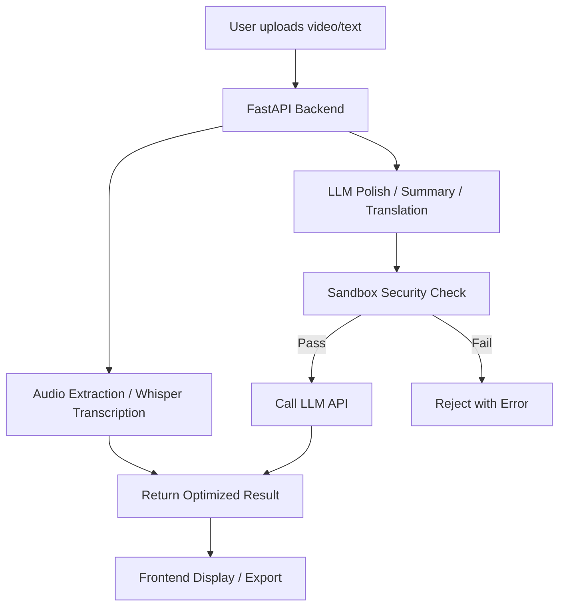
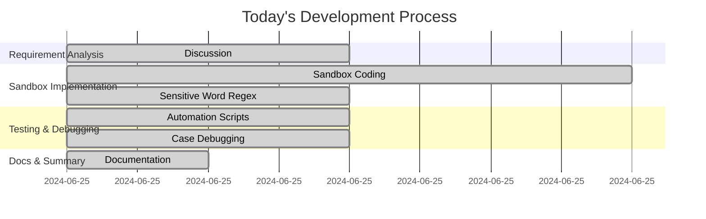

# 🗓️ Progress & Plans (2024-06-25)

## ✅ Completed (Today's Progress)

* Designed and implemented sandbox security mechanisms (API key validation, sensitive word filtering, resource limits, audit logs)
* Sensitive info detection supports Chinese-English, numeric patterns, and common formats (e.g., passwords, credit card numbers, ID numbers)
* Automated test suite for sandbox functionality, all test cases passed
* Containerization and Kubernetes orchestration support (security context, key management, resource limits)
* Documentation completed (sandbox and container tech overview, dev process guide)

## 🔮 To Do (Upcoming Plans)

* Support multiple LLMs (OpenAI, Anthropic, Google Gemini, etc.)
* Integrate LLM functions (polish/summarize/translate) into frontend
* Support user-defined API key proxy
* UI improvements for LLM-related interactions
* Support video URL direct upload and auto-download
* Add transcription history & multi-format export (TXT/SRT/VTT)
* Enable batch processing & task queue
* Complete Kubernetes production deployment docs
* Add API rate limiting and anti-abuse mechanisms
* Add OAuth/SSO user authentication
* Expand security use cases & test edge scenarios
* Enable CI/CD automation

---

## 🗺️ Project Architecture (Mermaid)



## 🚣️ Today's Dev Flow (Mermaid)



---

# 🔮 Next Steps

## 1. LLM Enhancement & Multi-Model Support

* [ ] Support various LLMs (OpenAI, Anthropic, Gemini, etc.)
* [ ] Integrate frontend LLM functions: polish, summary, translation
* [ ] Enable secure proxy for user-defined API keys

## 2. UX & Feature Enhancements

* [ ] UI optimization with LLM interaction support
* [ ] Direct video URL input & auto-download
* [ ] Transcription history & multi-format export (TXT/SRT/VTT)
* [ ] Batch processing & task queue

## 3. Deployment & Security

* [ ] Improve Kubernetes production deployment docs
* [ ] Implement API rate limiting & anti-spam
* [ ] Add OAuth/SSO authentication

## 4. Codebase & Testing

* [ ] Expand security test cases & edge scenario testing
* [ ] Enable CI/CD automation

---

# Video Transcription Generator MVP

A simple video transcription tool using Whisper AI for speech recognition.

## 🎯 MVP Features

* 🎩 Video file upload
* 🎵 Auto audio extraction
* 🤖 Whisper-based speech recognition
* 📝 Transcript display
* 🌍 Multilingual UI (CN, EN, RU, DE, FR, JP)
* 📊 Real-time processing log

## 🤓 Free Run Options

### Whisper Runtime Options

1. **Local** (Recommended) - 100% free, no API fees
2. **Hugging Face** - Free GPU compute
3. **Google Colab** - Free GPU (time-limited)

## 🚀 Quick Start

### 1. Install FFmpeg

```bash
# macOS
brew install ffmpeg

# Ubuntu
sudo apt install ffmpeg

# Windows
# Download from https://ffmpeg.org/download.html
```

### 2. Run Project

```bash
# Option 1: Use launch script
python run.py

# Option 2: Manual start
pip install -r requirements.txt
python app.py
```

### 3. Visit the App

Open browser: [http://localhost:8080](http://localhost:8080)

## 📁 Project Structure

```
project-root/
├── app.py               # Main FastAPI backend
├── languages.py         # Multilingual UI config
├── sandbox_config.py    # Sandbox security logic
├── test_sandbox.py      # Sandbox test suite
├── run.py               # Startup script
├── requirements.txt     # Python dependencies
├── Dockerfile           # Docker build config
├── k8s-deployment.yaml  # Kubernetes deployment config
├── SANDBOX_GUIDE.md     # Sandbox & containerization guide
├── README.md            # English documentation
├── README.zh-CN.md      # 中文文档
├── ...                  # Other modules/assets
```

## 🛠️ Tech Stack

* **FastAPI** - Web framework
* **Faster-Whisper** - Speech recognition
* **FFmpeg** - Audio extraction
* **HTML/JS** - Frontend UI

## 📝 User Instructions

1. Open the web app
2. Choose UI language
3. Choose video language
4. Drag-and-drop or upload video
5. Wait for processing
6. View transcript and logs

## 🔧 Config Options

In `app.py`:

* Whisper model size (tiny/base/small/medium/large)
* File size limits
* Audio quality options

## 🚀 Future Roadmap

### 1. 🌐 Streamlit Deployment

* [ ] Migrate app to Streamlit
* [ ] Use Streamlit cloud deployment
* [ ] Simplify UI & UX
* [ ] Add more interactive widgets

### 2. 🤖 LLM Extensions

* [ ] Integrate OpenAI GPT for polishing
* [ ] Smart summarization
* [ ] Key point extraction
* [ ] Multilingual translation
* [ ] Text formatting & structuring
* [ ] Q\&A based on transcripts

### 3. ☁️ Cloud Deployment Options

* [ ] **Google Colab**

  * Notebook version
  * Free GPU
  * Online demo ready
* [ ] **Hugging Face Spaces**

  * Hosted on HF platform
  * Free GPU
  * CI/CD support
* [ ] **Other Free Platforms**

  * Railway
  * Render (free tier)
  * Vercel (frontend)

### 4. 🔧 Technical Enhancements

* [ ] WebSocket for real-time updates
* [ ] Batch file support
* [ ] File format conversion
* [ ] Audio preprocessing optimization
* [ ] Add caching system

### 5. 📊 Feature Enhancements

* [ ] User auth & file management
* [ ] Transcription history
* [ ] Multi-format export (TXT, SRT, VTT)
* [ ] Subtitle generation
* [ ] Audio quality analytics

## 🤝 Contributions

Issues and PRs welcome!

## 📄 License

MIT License
