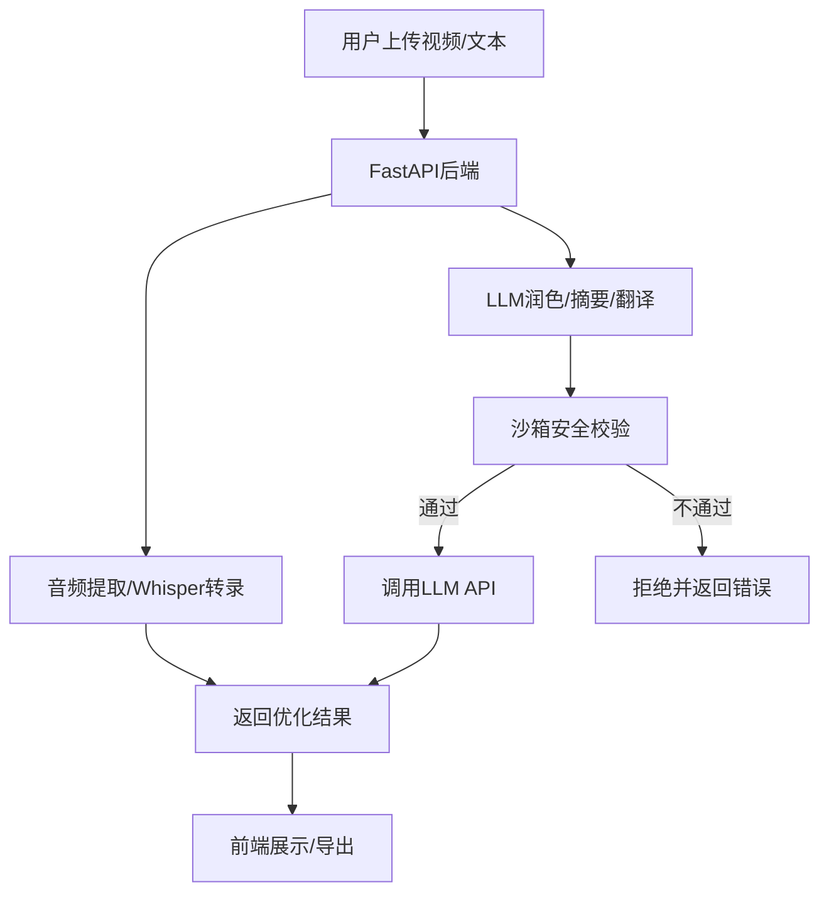
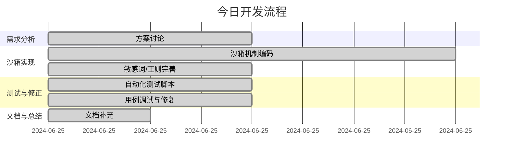

# 📅 进展与计划（2024-06-25）

## ✅ 已完成（今日进展）
- 沙箱安全机制设计与实现（API密钥校验、敏感词过滤、资源限制、审计日志）
- 敏感信息检测支持中英文、数字混合、常见敏感模式（如密码、信用卡号、身份证号等）
- 沙箱功能自动化测试体系，所有用例全部通过
- 容器化与Kubernetes编排支持（安全上下文、密钥管理、资源限制）
- 文档完善（沙箱与容器化技术说明、开发流程说明）

## 🔮 待办（未来开发计划）
- 支持多种LLM（OpenAI、Anthropic、Google Gemini等）
- 前端集成LLM润色/摘要/翻译功能
- 支持用户自定义API密钥安全代理
- 前端UI优化，增加LLM相关交互
- 支持视频链接直传与自动下载
- 增加转录历史与导出多格式（TXT/SRT/VTT）
- 支持批量处理与任务队列
- 完善Kubernetes生产部署文档
- 增加API限流与防刷机制
- 支持OAuth/SSO用户认证
- 增加更多安全用例与异常场景测试
- 持续集成与自动化部署

---

## 🗺️ 项目架构（Mermaid）



## 🛣️ 今日开发流程（Mermaid）



--- 

---

# 🔮 接下来要做的事情

## 1. LLM润色与多模型支持
- [ ] 支持多种LLM（OpenAI、Anthropic、Google Gemini等）
- [ ] 前端集成LLM润色/摘要/翻译功能
- [ ] 支持用户自定义API密钥安全代理

## 2. 用户体验与功能增强
- [ ] 前端UI优化，增加LLM相关交互
- [ ] 支持视频链接直传与自动下载
- [ ] 增加转录历史与导出多格式（TXT/SRT/VTT）
- [ ] 支持批量处理与任务队列

## 3. 部署与安全
- [ ] 完善Kubernetes生产部署文档
- [ ] 增加API限流与防刷机制
- [ ] 支持OAuth/SSO用户认证

## 4. 代码与测试
- [ ] 增加更多安全用例与异常场景测试
- [ ] 持续集成与自动化部署

---

# 视频转录生成器 MVP

一个简单的视频转录工具，使用Whisper AI进行语音识别。

## 🎯 MVP功能

- 📹 视频文件上传
- 🎵 自动音频提取
- 🤖 Whisper语音识别
- 📝 文字转录显示
- 🌍 多语言界面支持（中文、英语、俄语、德语、法语、日语）
- 📊 实时处理日志显示

## 🆓 免费运行方案

### Whisper运行位置
1. **本地运行** (推荐) - 完全免费，无需API费用
2. **Hugging Face** - 免费GPU资源
3. **Google Colab** - 免费GPU，有时间限制

## 🚀 快速开始

### 1. 安装FFmpeg
```bash
# macOS
brew install ffmpeg

# Ubuntu
sudo apt install ffmpeg

# Windows
# 下载 https://ffmpeg.org/download.html
```

### 2. 运行项目
```bash
# 方法1: 使用启动脚本
python run.py

# 方法2: 手动启动
pip install -r requirements.txt
python app.py
```

### 3. 访问网站
打开浏览器访问: http://localhost:8080

## 📁 项目结构

```
project-root/
├── app.py               # FastAPI主后端
├── languages.py         # 多语言界面配置
├── sandbox_config.py    # 沙箱安全逻辑
├── test_sandbox.py      # 沙箱测试脚本
├── run.py               # 启动脚本
├── requirements.txt     # Python依赖
├── Dockerfile           # Docker构建配置
├── k8s-deployment.yaml  # Kubernetes部署配置
├── SANDBOX_GUIDE.md     # 沙箱与容器化技术说明
├── README.md            # 英文文档
├── README.zh-CN.md      # 中文文档
├── ...                  # 其他模块/资源
```

## 🛠️ 技术栈
- **FastAPI** - Web框架
- **Faster-Whisper** - 语音识别
- **FFmpeg** - 音频提取
- **HTML/JS** - 前端界面

## 📝 使用说明
1. 打开网站
2. 选择界面语言
3. 选择视频语言
4. 拖拽或选择视频文件
5. 等待处理完成
6. 查看转录结果和详细日志

## 🔧 配置选项
在 `app.py` 中可以调整：
- Whisper模型大小 (tiny/base/small/medium/large)
- 文件大小限制
- 音频质量设置

## 🚀 未来开发计划

### 1. 🌐 Streamlit部署
- [ ] 将应用迁移到Streamlit平台
- [ ] 利用Streamlit的云部署功能
- [ ] 简化用户界面，提升用户体验
- [ ] 添加更多交互式组件

### 2. 🤖 LLM扩展功能
- [ ] 集成OpenAI GPT API进行文本润色
- [ ] 添加智能摘要功能
- [ ] 支持关键点提取
- [ ] 多语言翻译功能
- [ ] 文本格式化和结构化输出
- [ ] 支持问答功能（基于转录内容）

### 3. ☁️ 云端运行方案
- [ ] **Google Colab部署**
  - 创建Colab笔记本版本
  - 利用免费GPU资源
  - 支持在线运行和测试
- [ ] **Hugging Face Spaces**
  - 部署到Hugging Face免费平台
  - 利用免费GPU资源
  - 支持持续集成和自动部署
- [ ] **其他免费平台**
  - Railway部署
  - Render免费层
  - Vercel部署（前端）

### 4. 🔧 技术优化
- [ ] 添加WebSocket实时进度更新
- [ ] 支持批量文件处理
- [ ] 添加文件格式转换功能
- [ ] 优化音频处理算法
- [ ] 添加缓存机制

### 5. 📊 功能增强
- [ ] 用户认证和文件管理
- [ ] 转录历史记录
- [ ] 多种导出格式（TXT, SRT, VTT）
- [ ] 字幕文件生成
- [ ] 音频质量分析

## 🤝 贡献

欢迎提交Issue和Pull Request！

## �� 许可证

MIT License 